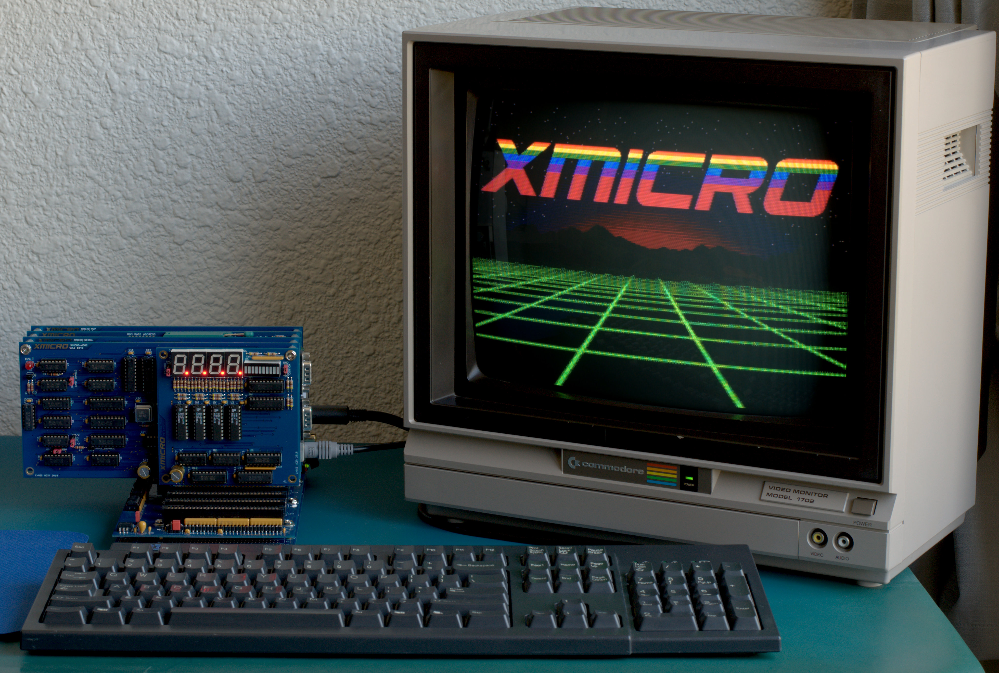
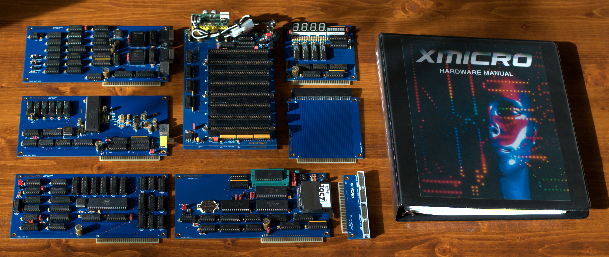
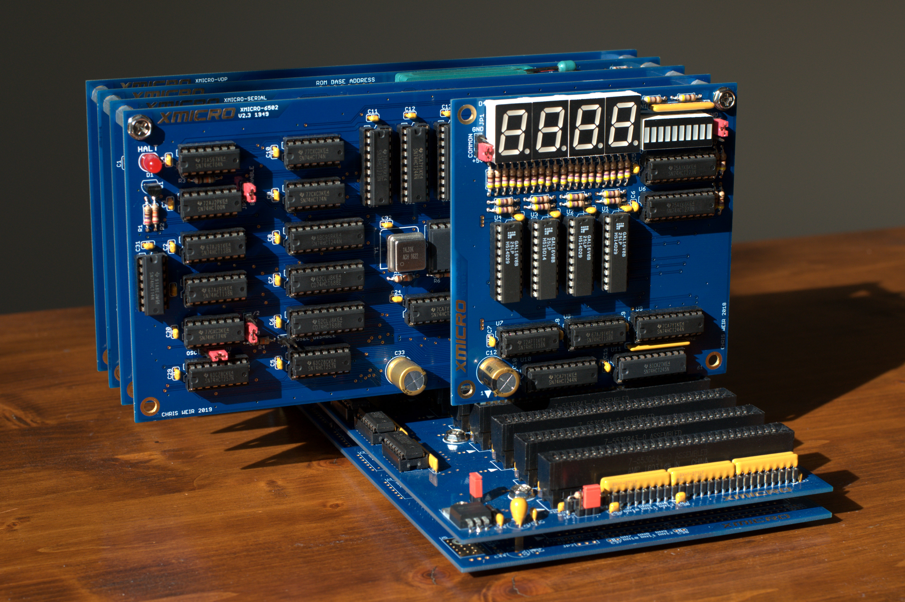

# XMICRO: A Modular 8-bit Microcomputer System
The XMICRO project began in 2017 as a hobby retrocomputer. Descending from a simple 6502-based breadboard computer, the decision was made to create a system without dependence on any particular CPU architecture. In this way, many CPUs could be used for experimentation without the need to create an entire computer system around each one. The name XMICRO, meaning "variable microarchitecture", is a nod toward technology companies of the microcomputer revolution such as Zilog.

## Current State
The [XMICRO Bus Specification](Documentation/XMICRO%20Bus%20Specification.pdf) is still in progress, however several hardware components have been created which make up a functional 6502-based microcomputer. These include:
* [XMICRO-BP8](https://github.com/X-Microsystems/xmicro-bp8): 8-slot Backplane
* [XMICRO-6502](https://github.com/X-Microsystems/xmicro-6502): W65C02 CPU Card
* [XMICRO-MEMORY](https://github.com/X-Microsystems/xmicro-memory): 1MB RAM, ROM, CompactFlash, and RTC Card
* [XMICRO-SERIAL](https://github.com/X-Microsystems/xmicro-serial): Dual RS232 and PS/2 Communications Card
* [XMICRO-VDP](https://github.com/X-Microsystems/xmicro-vdp): Yamaha V9958 Video Card

At this time, creating the specification is the top priority. Once this specification document is complete, all hardware projects will be updated to meet it. Work can then continue on other hardware and software projects.

